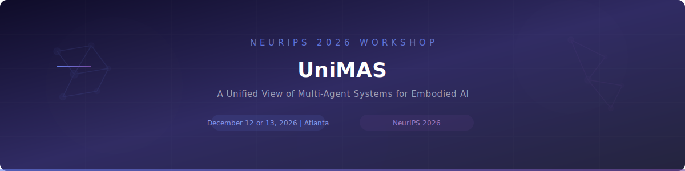

  

  
  

<h3 align="center">UniMAS: A Unified View of Multi-Agent Systems for Embodied AI</h3>

  <b>December 12 or 13, 2026</b> &nbsp;&bull;&nbsp; Atlanta, GA, USA 

---

## Overview

Multi-agent systems are central to real-world intelligent systems, from robotic teams and autonomous driving to manufacturing and healthcare, where agents must coordinate under uncertainty and changing conditions. At the same time, modern AI has produced a new class of multi-agent systems powered by LLMs, VLMs, and world models that can reason, plan, and coordinate in simulated environments.

**UniMAS** addresses the gap between these two paradigms. Robotics treats multi-agent systems as physically grounded control problems; modern AI treats them as reasoning and representation problems. We bring both sides together under a unified view of embodied intelligence, focusing on shared principles of representation, coordination, and distributed decision-making, making it a natural fit for NeurIPS.

We invite submissions on topics including but not limited to:

- **LLM-Based Multi-Agent Coordination** -- How language models enable agents to communicate and coordinate
- **Embodied Multi-Agent Systems** -- Robotic teams and physical systems with real-world constraints
- **Emergent Communication** -- How agents develop shared languages, from message passing to symbolic protocols
- **World Models for Agent Coordination** -- Using simulators and world models for planning and coordination
- **Multi-Agent Reinforcement Learning** -- Cooperative and competitive learning, parameter sharing, distributed training
- **Unifying Physical and Digital Agents** -- Bridging robotics control systems with AI reasoning agents

---

## Confirmed Keynote Speakers

| Name | Affiliation |
|------|-------------|
| **Dawn Song** | Professor, Computer Science, UC Berkeley |
| **Sergey Levine** | Associate Professor, EECS, UC Berkeley |
| **Jiajun Wu** | Assistant Professor, Computer Science, Stanford University |
| **Chi Wang** | Senior Staff Research Scientist, Google DeepMind (Creator of AutoGen) |

---

## Organizers

| Name | Role | Affiliation |
|------|------|-------------|
| **Xuan Wang** | Assistant Professor, Computer Science | Virginia Tech |
| **Manling Li** | Assistant Professor, Computer Science | Northwestern University |
| **Wenqi Shi** | Assistant Professor, Health Data Science | UT Southwestern Medical Center |
| **Yuchen Zhuang** | Research Scientist | Google DeepMind |
| **Ligeng Zhu** | Researcher | Nvidia |
| **Charles Flemming** | Senior Researcher | Cisco |
| **Zihan Wang** | VP of Research | Abaka AI |
| **Heng Ji** | Professor, Computer Science | UIUC |
| **Jiawei Han** | Michael Aiken Chair Professor, Computer Science | UIUC |

---

## Important Dates

| Milestone | Date |
|-----------|------|
| Paper Submission Deadline | August 29, 2026 |
| Acceptance Notification | September 29, 2026 |
| Camera-Ready Deadline | TBA |
| Workshop Day | **December 12 or 13, 2026** |

---

## Contact

For questions about the workshop, reach out at [unimas-workshop@googlegroups.com](mailto:unimas-workshop@googlegroups.com) or visit the [workshop website](https://unimas-workshop.github.io).

---

  UniMAS @ <a href="https://neurips.cc/Conferences/2026">NeurIPS 2026</a> &nbsp;&bull;&nbsp; Atlanta, GA, USA

